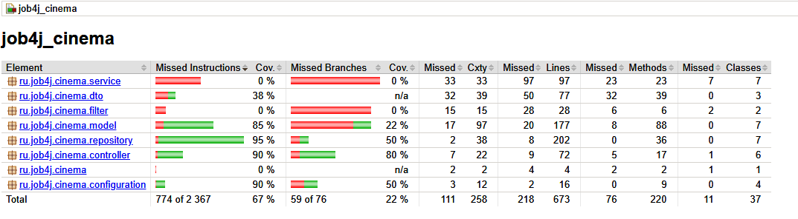

# job4j_cinema

## Описание проекта
Сайт кинотеатра. Позволяет смотреть расписание, делать покупку билетов

## Технологии
- Java 21
- Spring Boot
- Thymeleaf
- Bootstrap 5
- Sql2o
- PostgreSQL
- Liquibase

## Требования
- Java 17+
- Maven 3.8+
- PostgreSQL 15+

## Процент покрытия тестами 

## Автор
Kirill R.
